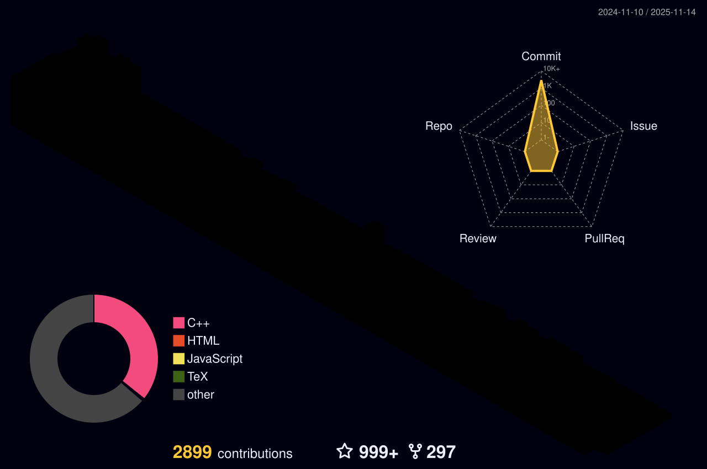

[](https://YuvrajSingh-16.github.io)

<h1 align="center">
  
  𝐇𝐞𝐥𝐥𝐨, &lt;𝚌𝚘𝚍𝚎𝚛𝚜/&gt;!
  
</h1>

<br/>
<br/>


- 🔭 I’m currently learning **AI Agents**
- 💬 Ask me about **Databricks, Python, Machine learning, AI, Data Science**
- 📫 Reach me here **yuvrajsinghk1602@gmail.com**
- 💬 𝙰𝚜𝚔 𝙼𝚎 𝙰𝚋𝚘𝚞𝚝 𝙰𝚗𝚢𝚝𝚑𝚒𝚗𝚐 [here](https://github.com/YuvrajSingh-16/YuvrajSingh-16/issues/1) ! 𝙸 𝚊𝚖 𝚑𝚊𝚙𝚙𝚢 𝚝𝚘 𝚑𝚎𝚕𝚙.

<br/>
<br/>


<p align="center">
   •   
<!--   <a href="https://user-badge.committers.top/india_private/YuvrajSingh-16"></a> • -->
   •
   •
  <a href="https://github.com/sponsors/YuvrajSingh-16"></a>
</p>
<!-- <p align="center">
  <code>
    
  </code>
</p> -->

#


<p align="center">
  
  
  
</p>

#

<br/>

**𝙻𝙰𝙽𝙶𝚄𝙰𝙶𝙴𝚂 𝙰𝙽𝙳 𝚃𝙾𝙾𝙻𝚂:**  

<br/>
<br/>


<p align="center">
  <a href="https://www.python.org" target="_blank"> 
    
  </a>
  <a href="https://www.djangoproject.com/" target="_blank"> 
     
  </a>
  <a href="https://www.w3schools.com/cpp/" target="_blank">
     
  </a> 
  <a href="https://www.tensorflow.org/" target="_blank">
    
  </a>
  <a href="https://www.kaggle.com/" target="_blank">
    
  </a>
  <a href="https://www.nodejs.org/" target="_blank">
    
  </a>
  <a href="https://spring.io/projects/spring-boot" target="_blank"> 
     
  </a> 
  <a href="https://www.javascript.com/" target="_blank">
    
  </a>
  <a href="https://www.mongodb.com/" target="_blank"> 
     
  </a> 
</p>
#

<code></code>
<code></code>
<code></code>
<code></code>
<code></code>
<code></code>
<code></code>
<code></code>
<code></code>


<br/>

#

<details open="">
<summary>
  <g-emoji class="g-emoji" alias="chart_with_upwards_trend" fallback-src="https://github.githubassets.com/images/icons/emoji/unicode/1f4c8.png">📈</g-emoji>
  <strong>𝙶𝚒𝚝𝚑𝚞𝚋 𝚂𝚝𝚊𝚝𝚜 : </strong>
</summary>
<br/>

<p align="center">
    
    
</p>
</details>
<br/>




<h4 align="center">
  
```diff
+@ @ @ @ @ @ @ @ @ @ @ @ @ @ @ @ @ @ @ @ @ @ @ @ @ @ @ @+
@@       o o                                           @@
@@       | |                                           @@
@@      _L_L_                                          @@
@@   ❮\/__-__\/❯ Programming isn't about what you know @@
@@   ❮(|~o.o~|)❯  It's about what you can figure out   @@
@@   ❮/ \`-'/ \❯                                       @@
@@     _/`U'\_                                         @@
@@    ( .   . )     .----------------------------.     @@
@@   / /     \ \    | while( ! (succeed=try() ) ) |     @@
@@   \ |  ,  | /    '----------------------------'     @@
@@    \|=====|/                                        @@
@@     |_.^._|                                         @@
@@     | |"| |                                         @@
@@     ( ) ( )   Testing leads to failure              @@
@@     |_| |_|   and failure leads to understanding    @@
@@ _.-' _j L_ '-._                                     @@
@@(___.'     '.___)                                    @@
+@ @ @ @ @ @ @ @ @ @ @ @ @ @ @ @ @ @ @ @ @ @ @ @ @ @ @ @+
```

</h4>  
  


<br/>

#

<summary>
  <g-emoji class="g-emoji" alias="chart_with_upwards_trend" fallback-src="https://github.githubassets.com/images/icons/emoji/unicode/1f4c8.png">📈</g-emoji>
  <strong>𝚆𝚊𝚔𝚊𝚃𝚒𝚖𝚎 𝚂𝚝𝚊𝚝𝚜 : </strong>
</summary>


<br>
<br>

<!--START_SECTION:waka-->


**🐱 My GitHub Data** 

> 📦 14.2 MB Used in GitHub's Storage 
 > 
> 🏆 1,850 Contributions in the Year 2025
 > 
> 💼 Opted to Hire
 > 
> 📜 207 Public Repositories 
 > 
> 🔑 2 Private Repositories 
 > 
**I'm a Night 🦉** 

```text
🌞 Morning                17758 commits       █████░░░░░░░░░░░░░░░░░░░░   18.36 % 
🌆 Daytime                27266 commits       ███████░░░░░░░░░░░░░░░░░░   28.20 % 
🌃 Evening                33342 commits       █████████░░░░░░░░░░░░░░░░   34.48 % 
🌙 Night                  18335 commits       █████░░░░░░░░░░░░░░░░░░░░   18.96 % 
```
📅 **I'm Most Productive on Sunday** 

```text
Monday                   13461 commits       ███░░░░░░░░░░░░░░░░░░░░░░   13.92 % 
Tuesday                  13554 commits       ████░░░░░░░░░░░░░░░░░░░░░   14.02 % 
Wednesday                13720 commits       ████░░░░░░░░░░░░░░░░░░░░░   14.19 % 
Thursday                 13478 commits       ███░░░░░░░░░░░░░░░░░░░░░░   13.94 % 
Friday                   13498 commits       ███░░░░░░░░░░░░░░░░░░░░░░   13.96 % 
Saturday                 14105 commits       ████░░░░░░░░░░░░░░░░░░░░░   14.59 % 
Sunday                   14885 commits       ████░░░░░░░░░░░░░░░░░░░░░   15.39 % 
```


📊 **This Week I Spent My Time On** 

```text
🕑︎ Time Zone: Asia/Kolkata

💬 Programming Languages: 
Other                    22 hrs 43 mins      █████████████████████████   99.91 % 
Text                     1 min               ░░░░░░░░░░░░░░░░░░░░░░░░░   00.09 % 

🔥 Editors: 
Chrome                   22 hrs 44 mins      █████████████████████████   100.00 % 

🐱‍💻 Projects: 
job-fit                  22 hrs 44 mins      █████████████████████████   99.99 % 
LeetCode                 0 secs              ░░░░░░░░░░░░░░░░░░░░░░░░░   00.01 % 

💻 Operating System: 
Mac                      22 hrs 44 mins      █████████████████████████   100.00 % 
```

**I Mostly Code in Jupyter Notebook** 

```text
C++                      20 repos            ███░░░░░░░░░░░░░░░░░░░░░░   13.79 % 
JavaScript               12 repos            ██░░░░░░░░░░░░░░░░░░░░░░░   08.28 % 
Dockerfile               2 repos             ░░░░░░░░░░░░░░░░░░░░░░░░░   01.38 % 
TeX                      1 repo              ░░░░░░░░░░░░░░░░░░░░░░░░░   00.69 % 
R                        1 repo              ░░░░░░░░░░░░░░░░░░░░░░░░░   00.69 % 
```


 Last Updated on 14/11/2025 02:53:36 UTC
<!--END_SECTION:waka-->

<p align="center">
  
  
</p>

#

<p align="center">
    
  <h4 align="center"><code>📊 𝙶𝚒𝚝𝙷𝚞𝚋 𝙼𝚎𝚝𝚛𝚒𝚌𝚜</code></h4>
</p>

<!-- <p align="center">
  
  
</p> -->

<h1>
  Connect With Me
  
</h1>

<p align="center">
  <br>
  <a href="https://www.linkedin.com/in/yuvraj-singh-kiraula-5819a2196/" target="_blank">
    <code></code>
  </a>
  <a href="https://www.facebook.com/YuvrajSingh-16/" target="_blank">
    <code></code>
  </a>
  <a href="https://www.instagram.com/YuvrajSingh-16/" target="_blank">
    <code></code>
  </a>
  <a href="https://twitter.com/YuvrajSingh-16" target="_blank">
    <code></code>
  </a>
  <a href="https://dev.to/YuvrajSingh-16">
    <code></code>
  </a>     
</p>
<br/>

<p align="center">
  <a href="https://www.hackerrank.com/YuvrajSinghK/" target="_blank">
    <code></code>
  </a>

  <a href="http://www.codeforces.com/profile/YuvrajSingh-16" target="_blank">
    <code></code>
  </a>

  <a href="https://www.hackerearth.com/@YuvrajSingh-16" target="_blank">
    <code></code>
  </a>

  <a href="https://www.codechef.com/users/YuvrajSingh-16" target="_blank">
    <code></code>
  </a>
  
  <a href="https://leetcode.com/UVSinghK/" target="_blank">
    <code></code>
  </a>
</p>

<br/>
<br/>

<div align="center">

### 𝚂𝚑𝚘𝚠 𝚜𝚘𝚖𝚎 ❤️ 𝚋𝚢 𝚜𝚝𝚊𝚛𝚛𝚒𝚗𝚐 𝚜𝚘𝚖𝚎 𝚘𝚏 𝚝𝚑𝚎 𝚛𝚎𝚙𝚘𝚜𝚒𝚝𝚘𝚛𝚒𝚎𝚜!

</div>

#


